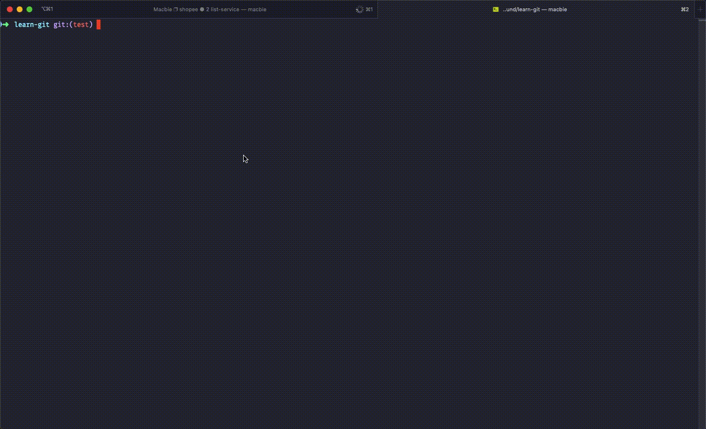

# Git Pre Push Prompt

This snippet will help prompt the user when pushing staged changes onto the protected branches

# Demo



# Installation & Setup

Run the following command (replace `{project-root-folder}` with yours):

```bash
cd {project-root-folder}
wget https://raw.githubusercontent.com/kz-sher/git-pre-push-prompt/master/git-pre-push-prompt -O .git/hooks/pre-push
chmod a+x .git/hooks/pre-push
```

# Got Question?

> kzsherdev@gmail.com
